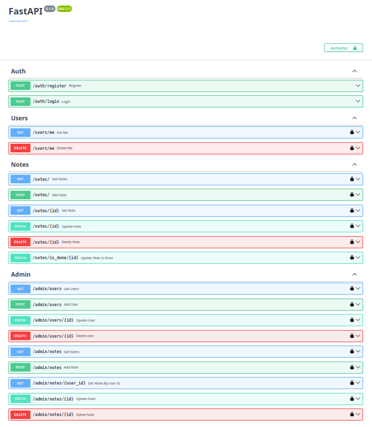

# Users & Notes API

A FastAPI REST API project for managing users and notes. Integrates PostgreSQL, presents role-based access and JWT authentication.
First portfolio project.



## Features

- JWT authentication (login/register)
- Password hashing (bcrypt)
- User endpoints (/me)
- Notes CRUD (only own notes)
- Admin panel (manage users & notes)
- Role-based access (admin/user)
- PostgreSQL on Docker (start using docker-compose.yml)

## Tech Stack

- FastAPI
- SQLAlchemy
- docker-compose
- Pydantic
- Alembic
- python-jose (JWT)
- passlib (bcrypt)

## Run

```bash
git clone https://github.com/Adrode/fastapi_users_notes_api.git
cd users_notes_api
python -m venv env
source env/bin/activate # on Linux
pip install -r requirements.txt
docker compose up -d # starts PostgreSQL image on container; Docker required
uvicorn main:app --reload
```

Docs:
http://127.0.0.1:8000/docs

## Functionality

- Users can access only their own notes
- Admin can manage all users & notes
- Tokens expire (JWT)
- Notes support is_done status
- Users support is_active status